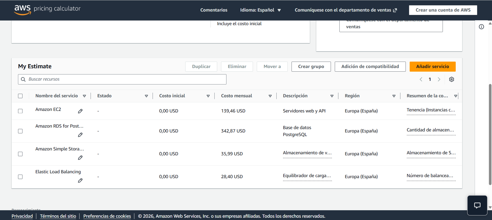
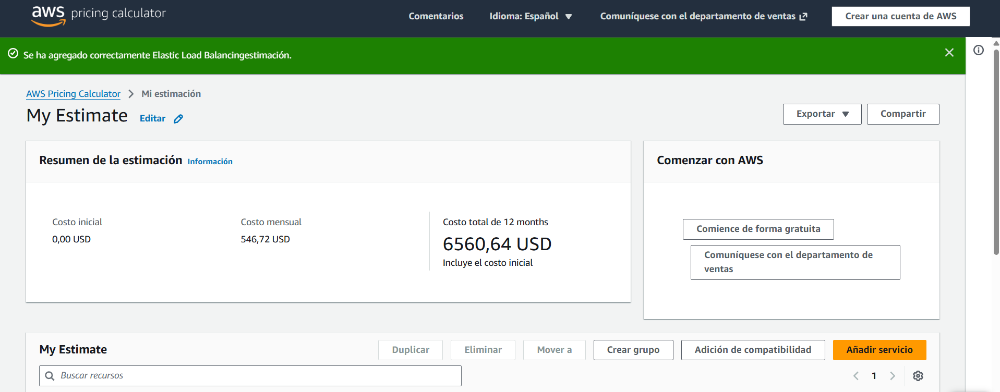

# Case Study: Migration of the "EduOnline" Platform

**Name:** Marc Bonet i Navarro

## 1. Architecture Configuration

### 1.1 Amazon EC2

* **Number of instances:** 3
* **Operating System:** Linux (Amazon Linux)
* **Instance Type:** `t3.medium`
* **vCPUs:** 2
* **RAM:** 4 GB
* **Payment Model:** On-Demand
* **Usage:** 730 hours/month
* **EBS Storage:** 50 GB gp3 per instance
* **Total EBS Storage:** 150 GB gp3

**Estimated monthly cost:** 139,46 €

### 1.2 Amazon RDS

* **Database Engine:** PostgreSQL
* **Deployment:** Multi-AZ
* **Instance Type:** `db.m6g.large`
* **vCPUs:** 2
* **RAM:** 8 GB
* **Payment Model:** 1-Year Reserved / Savings Plan
* **Payment Option:** No Upfront
* **Storage:** 200 GB
* **Storage Type:** General Purpose SSD (`gp3`)

**Estimated monthly cost:** 342,87 €

### 1.3 Amazon S3

* **Storage Class:** S3 Standard
* **Storage Capacity:** 1,500 GB (1.5 TB)
* **PUT/POST/LIST Requests:** 50,000 requests/month
* **GET/SELECT Requests:** 1,000,000 requests/month

**Estimated monthly cost:** 35,99 €

### 1.4 Elastic Load Balancing

* **Load Balancer Type:** Application Load Balancer (ALB)
* **Number of Load Balancers:** 1
* **Processed Network Traffic:** 500 GB/month

**Estimated monthly cost:** 28,40 €

---

## 2. Total Cost

| Service                   | Monthly Cost |
| ------------------------- | -----------: |
| Amazon EC2                |         139,46 € |
| Amazon RDS                |         342,87 € |
| Amazon S3                 |         35,99 € |
| Application Load Balancer |         28,40 € |
| **Total**                 |     **546,72 €** |

### Monthly Cost

**546,72 € / month**

### Annual Cost

**6560,64 € / year**

Calculation:

`546,72 € × 12 = 6560,72 €`

## 3. Most Expensive Service

The most expensive service in the architecture is:

**Amazon RDS**

* **Monthly cost:** 342,87 €
* **Total monthly cost:** 4114,44 €

### Percentage of Total Cost

Calculation:

`(Service cost / Total cost) × 100`

`(XX / XX) × 100 = XX %`

Therefore, **Amazon RDS represents approximately 5 % of the total monthly cost.**

## 4. Cost Optimization – EC2 Savings Plan

The original EC2 configuration uses **On-Demand instances**.

### On-Demand

* 3 × `t3.medium`
* Linux
* 730 hours/month

**Monthly cost:** 139,46 €

### 1-Year Savings Plan – No Upfront

The same EC2 configuration was estimated using a **1-Year Savings Plan with No Upfront payment**.

**Monthly cost:** 1673,52 €

## 5. Conclusion

The AWS Pricing Calculator was used to estimate the monthly and annual cost of migrating the platform to AWS in the Spain region.

The estimated infrastructure consists of Amazon EC2 for the web/API servers, Amazon RDS for the PostgreSQL database, Amazon S3 for file and content storage, and an Application Load Balancer for network traffic distribution.

## 6. AWS Pricing Calculator Evidence

